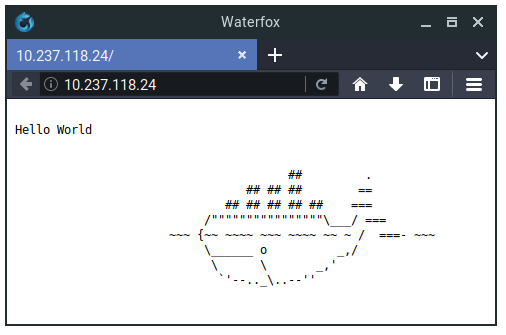

# Running docker inside LXD

## Overview
Duration: 2:00

[LXD](https://linuxcontainers.org/lxd) is a container hypervisor providing a ReST API to manage LXC system containers.

[Docker](https://www.docker.com/) implements application containers, which are typically used to run main process, not the whole system.

Although these usages sometimes overlap each other, you may want to run Docker container inside LXC container with LXD. That’s what this tutorial will cover.

### Requirements

  - A computer running Ubuntu 16.04 or newer
  - Basic knowledge of LXD

## Creating privileged container
Duration: 2:00

To use Docker, we need to make our LXD container privileged. We can both create privileged container and set existing container as privileged.

### Creating new container

To create new, privileged LXD container, use `lxc launch` command with `-c security.nestin=true` option:

```bash
lxc launch ubuntu-daily:16.04 docker-tutorial -c security.nesting=true
```

### Configuring existing container

To make our existing container privileged, we canuse following command:

```bash
lxc config set your-container security.privileged true
```

## Installing Docker
Duration: 3:00

After creating container, we can switch to our container shell and install `docker.io` package:

```bash
lxc exec docker-tutorial /bin/bash
apt update
apt install docker.io -y
```

We have installed Docker! Now, let’s use it to start simple web server basing on application container.

## Running application container
Duration: 2:00

To run new containerwe will use `docker run` command. `-d` makes the process run in background. We can set `--name` to anything we want. `crccheck/hello-world` is one of the simplest Docker “Hello world” images that can be used for testing purposes.

```bash
$ docker run -d --name docker-test -p 80:8000 crccheck/hello-world
Unable to find image 'crccheck/hello-world:latest' locally
latest: Pulling from crccheck/hello-world
0ffadd58f2a6: Pull complete
27f68e2bbdea: Pull complete
Digest: sha256:7d7cc93feaf132dc854d3ca0a2a58de2dc700a3bcd79d352616766065c36e770
Status: Downloaded newer image for crccheck/hello-world:latest
5e8961e8a4f23d4f07d6b42fb478145b79b7b4e2e8c85914c0ce3d14b69f272f
```

We can now exit our container shell with `exit`.

## Testing example
Duration: 1:00

To test whether our Docker application works properly from LXD, we can open IP address of our LXD container from web browser. To find container IP address, use `lxc list`:

```bash
$ lxc list
+-----------------+---------+--------------------------------+-------------------------------+
|      NAME       |  STATE  |              IPV4              | IPV6 |    TYPE    | SNAPSHOTS |
+-----------------+---------+--------------------------------+------+------------+-----------+
| docker-tutorial | RUNNING | 172.17.0.1 (docker0)           |      | PERSISTENT | 0         |
|                 |         | 10.237.118.24 (eth0)           |      |            |           |
+-----------------+---------+--------------------------------+------+------------+-----------+
```



It worked!

## That’s all
Duration: 1:00

Congrats, you made it! Now you should know how to use Docker containers inside LXD containers. You can now try to deploy more complex application. There are thousands of them!

If you’d like to know more about LXD, take a look at the following resources:

* [LXD documentation in the source tree](https://github.com/lxc/lxd)
* [LXD 2.0 blog post series by Stéphane Graber](https://stgraber.org/2016/03/11/lxd-2-0-blog-post-series-012/)

Also, if you have questions or need help, you can find direct help here:

* [Linux Containers forum](https://discuss.linuxcontainers.org/)
* [Ask Ubuntu](https://askubuntu.com/)
* The `#lxcontainers` IRC channel on Freenode

