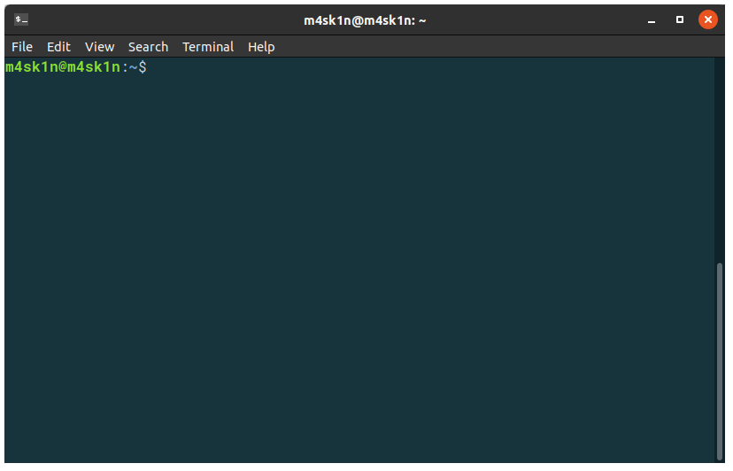

# Learn Linux terminal usage

## Overview
Duration: 1:00

**Terminal emulators** are one of the ways to use your computer, just as **graphical user interfaces** using mouse and keyboard or touch screen. In this tutorial, you will learn, how to use terminal emulator for simple tasks and check manual pages to get help with correct command usage.

positive
: Don’t think of terminal as something antiquated, think of it as a different approach to control computer, which is way easier in many cases, but requires more experience.

### What you’ll need

  - A computer running Ubuntu or other Linux distribution

The tutorial doesn’t assume you have any previous experience with using terminal.

## Using terminal emulator
Duration: 3:00

### What is terminal emulator?

Terminals were invented in the 50s. They were electronic hardware devices printing (or displaying on the screen) output from an operating system. After introduction of other display architectures, terminal emulators were created to imitate terminal interfaces. Currently, almost every modern operating system (including Linux distributions, macOS and Windows) includes a terminal emulator.

### Terminal emulator on Ubuntu

Ubuntu distribution comes with GNOME Terminal as its default terminal emulator. It contains features like tabs, color schemes and mouse events. Using other terminal emulators (like Tilix, Konsole or Xfce Terminal) doesn’t look very different, so you can use them to finish the tutorial too.



Run GNOME Terminal. It is available in applications menu and under Ctrl+Alt+K shortcut. You should see the window containing menu bar and Bash shell – the default shell for almost every major Unix-like operating system. Here you will type all the commands.

## Essential commands
Duration: 10:00

### cd – Change directory

In terminal, everything happens inside a directory. It can be the root directory (/), your home directory (eg. /home/m4sk1n) or any directory you will navigate to. Traditionally, you home directory is presented as `~` char. If you will change your directory to a subdirectory in your home directory, terminal will show it as relative path, basing on home directory. Terminal starts in home directory. Assume that you have created `tutorial` directory. You can open it in terminal with `cd tutorial`, just after running it.

```bash
$ cd tutorial
```

positive
: In this tutorial, `$` stands for command to be run as user with standard permissions. `#` means that the command should be run from root account. Everything else is output of entered command.

negative
: Unix filesystems are case-sensitive

### ls – List files

The `ls` command stands for “list segments”. Segments concept isn’t present in Unix-like systems, it came from Multics operating system, which Unix derives from.

You can use this command to list files and directories in current directory on Linux system. Example:

```bash
$ ls
a.out           main.cpp
main.h          README.md
```

### mkdir – Make directory

The name of this commend says absolutely everything. You can create directory with specified name. This command requires providing name as parameter. To create directory and check whether it will appear:

```bash
$ mkdir src
$ ls
src             a.out
main.cpp        main.h
README.md
```

### cp – Copy file or directory

To copy existing file, use cp command. It requires two arguments – original file and target file (or directory where you want to put the file. Example:

```bash
$ cp main.cpp src/
$ cd src
$ ls
main.cpp
```

positive
: To copy a directory, you need to add `-r` (recursively) parameter at the end of the command, for example: `cp src src-20180118 -r`. Almost every command has its parameters. For example, try to run `ls -a`.

### mv – Move files and directories

As with previously mentioned `cp` command, `mv` requires two arguments – original file and target. The only difference is that original file will be removed after copying.

### rm – Remove files and directories

To remove file, you can use `rm` command with file as an argument. Removing directory requires `-f` parameter.

```bash
$ cd ~/tutorial # back to the tutorial directory
$ ls
src             a.out
main.cpp        main.h
README.md
$ rm a.out
$ ls
src             main.cpp
main.h          README.md
```

### less – View file content

To preview content of file from terminal, we can use `less` command. We can use space key to move forward in case the file won’t fit the screen and “q” letter to exit this program.

positive
: To check how to move backward, you can read corresponding manual page, I’ll explain it soon.

## Little more about navigating
Duration: 2:00

### Relative and absolute paths

In Linux terminal, you can use both relative and absolute paths to specify location. For example, assuming that your username is “m4sk1n” and /home/m4sk1n/ is your current directory, both `/home/m4sk1n/foo/bar` and `foo/bar` points to the same file. To point to a location in other user account, you can append his username after `~` char, for example `~john/hello.world`.

### Special notations

To point to a parent directory from current directory, use `..`. For example, if you want to change directory to “/home/john/foo” folder, but you’re currently in the “/home/john/bar” folder, use `cd ../bar`. Single dot – `.` stands for current directory.

## Getting help
Duration: 2:00

### --help parameter

Most of the standard Linux programs provides `--help` (often aliased to `-h`) command, allowing us to get simple information about command, example usage, available parameters etc.

### Manual pages

The easiest way to get complex information on how to use specific command is using `man` program. To give you practical example, I suggest to just try `man man`. Use “q” key if you want to exit manual pages.

## That’s all!

I hope this tutorial explained you how to perform basic file operations using terminal. If you’d like to learn more about it, take a look at the following resources:

* [Using the Terminal page on Ubuntu Community Wiki](https://help.ubuntu.com/community/UsingTheTerminal_)

Also, if you have questions or need help, you can find direct help here:

* [Ask Ubuntu](https://askubuntu.com/)
* [Ubuntu Forums](https://ubuntuforums.org/)
* [IRC-based support](https://wiki.ubuntu.com/IRC/ChannelList)
